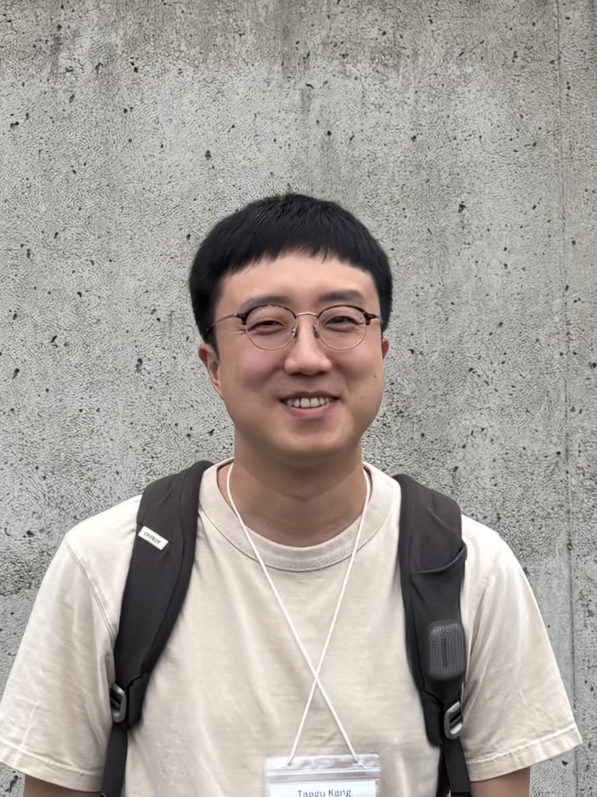

# Taegu Kang

E-mail: taeguk2 AT illinois DOT edu  
Department of Mathematics, University of Illinois, Urbana-Champaign

### About:

- I am a graduate student in the Department of Mathematics at UIUC.
- My research is in probability theory, with a focus on spin glasses and disordered systems.

### Education:

- Ph.D. in Mathematics, University of Illinois, Urbana-Champaign (2024-).
- B.S. in Mathematics, Seoul National University (2022-2024).

### Research:

- [P. S. Dey](https://psdey.web.illinois.edu), T. Kang, [Fluctuations for the Sherrington-Kirkpatrick spin glass model near the critical temperature](https://arxiv.org/abs/2603.05636), Preprint.
